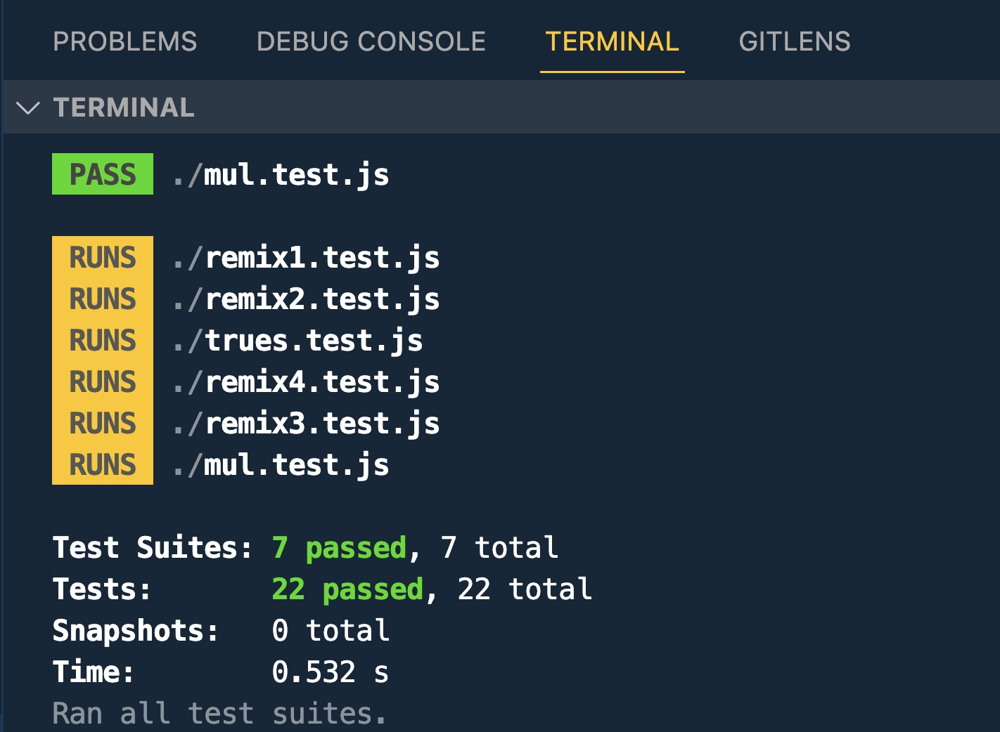

# Name of project

Solution-write-up-example

## Table of contents

- [Name of project](#name-of-project)
  - [Table of contents](#table-of-contents)
  - [General info](#general-info)
  - [Screenshots](#screenshots)
  - [Technologies](#technologies)
  - [Setup](#setup)
  - [Code Examples](#code-examples)
  - [Features](#features)
  - [Status](#status)
  - [Inspiration](#inspiration)
  - [Contact](#contact)

## General info

The purpose of this simple project is to demonstrate how JSDoc works for basic use cases and how to create a simple test suite for functions. The project begins with a solution written for an Edabit challenge. Then, we'll create four different alternative solutions using ChatGPT.

We have a function written for an Edabit challenge, and we want to explore alternative solutions to solve the same problem. Throughout the process, we'll use JSDoc to document the functions and create a basic test suite to ensure their correctness.
The initial solution is as follows:

```JavaScript
function count_true(lst) {
  let count = 0;
  for (let i = 0; i < lst.length; i++) {
    if (lst[i] === true) {
      count++; // count = count + 1
    }
  }
  return count;
}
```

the alternative solutions together with the tests are called remixes:

- remix1.test.js
- remix2.test.js
- remix3.test.js
- remix4.test.js

Some other very basic examples are provided.

This project was built following [this guide](https://github.com/HackYourFutureBelgium/solution-write-ups)

[Read](./example_count_true_values.md) How to create it from scratch

This simple project showcased how JSDoc annotations can be used to document functions and how to create a basic test suite to verify the correctness of the solutions. With ChatGPT's help, we explored four alternative solutions to the initial problem and successfully tested them using the test suite.

## Screenshots



## Technologies

- Node 18.16.1
- Jest 29.6.1
- JSDoc 4.0.2
- JSDoc-to-Markdown 8.0.0

## Setup

- `npm i`
- `npm run test` // run unit tests.
- `npm run doc` // creates the HTML documentation inside the `./out` folder
- `npm run markdown` // creates the Markdown documentation in `note.md`.

## Code Examples

```JavaScript
/**
 * create a function which returns the number of true values there are in an array
 *
 * @param {[boolean]} lst An array of booleans
 * @returns {number} How many true values are in the array
 */
function count_true(lst) {
  let count = 0;
  for (let i = 0; i < lst.length; i++) {
    if (lst[i] === true) {
      count++;
    }
  }
  return count;
}

const test1 = count_true([true, false, true]);

describe("given an array of booleans count how many true values there are", () => {
  it("count_true([true, false, true]) => 2", () => {
    expect(test1).toEqual(2);
  });
});
```

## Features

List of features:

- 4 different implementations of the same original script
- different tests made with Jest
- an utility to create Markdown documentation in the `docs.md` file.
- a script to create HTML documentation inside the `./out` folder

## Status

Project is: _done_

## Inspiration

Project by HYF Belgium

## Contact

By bermarte
